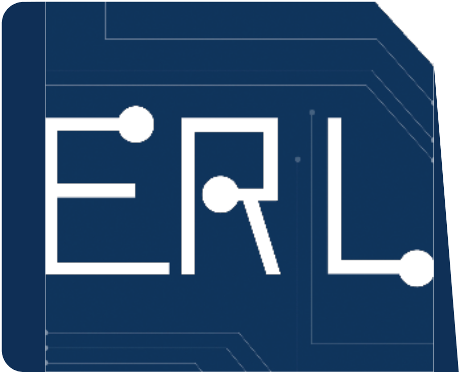
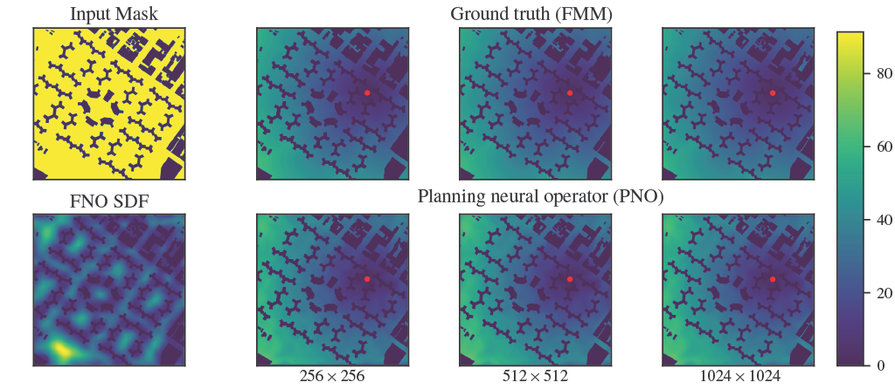

<div align="center">
  <a href="http://erl.ucsd.edu/">
    
  </a>
  <a href="https://contextualrobotics.ucsd.edu/">
    
  </a>
  <a href="https://ucsd.edu/">
    
  </a>
</div>

# Planning Neural Operator: Generalizable motion planning via operator learning
<div align="center">
 <a href="#"></a>
</div>


[Paper](https://openreview.net/pdf?id=UYcUpiULmT) |
[GitHub](https://github.com/ExistentialRobotics/PNO) |
[arXiv](https://arxiv.org/abs/2410.17547) |
Published in ICLR 2025.


## Introduction

This repository is the official implementation of "Generalizable Motion Planning via Operator Learning". Please refer to the 2D example below for quick access into the method 
and for a futher dive, please see the models section below. 

More extensive experiments related to iGibson Environments, Manipulator and Neural Heuristics are covered in the last section

# 2D example - Ablation & Super-Resolution Results
See `examples` folder for a notebook that immediately reproduces the 2D results for the paper. To get the notebook working, 
we provide both pretrained models as well as the corresponding datasets to make your own at 
- [Dataset](https://huggingface.co/datasets/lukebhan/generalizableMotionPlanning)
- [Models](https://huggingface.co/lukebhan/generalizableMotionPlanningViaOperatorLearning)

To ensure the paths are correct, place both folders inside the example folder. The dataset is quite large and may take some time to download. 
The current example is working under Python 3.10.1, PyTorch Version 2.5.1, and the compatabile numpy libraries. Be sure to use this version
of torch in your Cuda enviornment to avoid compatabilitiy issues. 

Installation

- Setup your CUDA environment (or CPU) with the corresponding packages
  
  >The repository directory should look like this:
```
PNO/
├── examples/
│   ├── dataset/    # training and testing dataset
│   ├── results/    # training results
│   ├── utilities/    
│   ├── model/ # model implementations
│   └── 2DexampleNotebook.ipynb   # jupyternotebook
•   •   •
•   •   •
```
where the hierarchy is given via bullets and the results folder has all of the models downloaded from Hugging Face.

- Run the jupyter-notebook. Sections 1 and 2 allow you to train your own models but they can be skipped. Sections 3 and 4 quantitatively test the models and reproduce the results in the paper. 

If you have any issues, feel free to create an issue in this github repo or email the authors. 

# 3D iGibson Environments, 4D Manipulator and Neural Heuristics Experiments
In this section, we show how to reproduce results of the Heuristics.
We provide pre-trained models and the datasets used. We briefly describe on how the datasets were generated for each experiment.

### 3D iGibson Experiments
We used the environments introduced in the Interactive Gibson Benchmark (iGibson 0.5) [Xia et al., 2020](https://arxiv.org/abs/1910.14442), which provides a suite of photorealistic, interactive, and cluttered 3D scenes for benchmarking navigation tasks. Binary occupancy maps were generated using the open-source voxelization tools available in the GitHub repository [Voxelizer and SDF](https://github.com/rFalque/voxelization_and_sdf). The Signed Distance Function was generated using [Scipy.ndimage](https://docs.scipy.org/doc/scipy/reference/generated/scipy.ndimage.distance_transform_edt.html) package. FMM was used to generate the value functions. [Pykonal](https://malcolmw.github.io/pykonal-docs/) was used specifically for this expertiment.

The dataset and the model used in the experiments in the paper are provided in the link below. 

- [Dataset](https://huggingface.co/datasets/sharathmatada/igib-dataset-160-5G)
- [Model](https://huggingface.co/sharathmatada/iGibson_3D_Model)


### 4D Manipulator Experiments
For the 4D Manipulator Experiments, we generated the binary occupany map in the configuration space of the manipulator using the [checkCollision](https://www.mathworks.com/help/robotics/ug/create-collision-objects-for-manipulator-collision-checks.html) function available on MATLAB. The function allows for computing the occumpany map while accounting for self-collision and collision with obstacles in the environment. For the purposes of the experiment, we chose the [ROBOTIS OpenMANIPULATOR 4-axis robot with gripper](https://www.mathworks.com/help/robotics/ref/loadrobot.html). The value functions were generated using [ScikitFMM](https://pypi.org/project/scikit-fmm/0.0.1/) as it is able to provide value functions for n-dimensional input functions.

- [Dataset](https://huggingface.co/datasets/sharathmatada/4D-OccupancyGrids)
- [Model](https://huggingface.co/sharathmatada/4D_Manipulator_Model)


### Neural Heurisics on MovingAI lab 2D city dataset
Here we link the dataset and models used in the Neural Heuristics section. Please note that to compute the value functions, we used the Dijkstra's algorithm. For more details, please check the Appendix. Dataset and models used for each experiment are linked below.

256x256
- [Dataset](https://huggingface.co/datasets/sharathmatada/2D-256-Dataset-0)
- [Model](https://huggingface.co/sharathmatada/256-MovingAI)

512x512
- [Dataset](https://huggingface.co/datasets/sharathmatada/2D-512-Dataset-0)
- [Model](https://huggingface.co/sharathmatada/512-MovingAI)

1024x1024
- [Dataset](https://huggingface.co/datasets/sharathmatada/2D-1024-Dataset-0)
- [Model](https://huggingface.co/sharathmatada/1024-MovingAI)


### Citation 
If you found this work useful, we would appreciate if you could cite our work:
```
@inproceedings{
matada2025generalizable,
title={Generalizable Motion Planning via Operator Learning},
author={Sharath Matada and Luke Bhan and Yuanyuan Shi and Nikolay Atanasov},
booktitle={The Thirteenth International Conference on Learning Representations},
year={2025},
url={https://openreview.net/forum?id=UYcUpiULmT}
}
```

### Licensing
<a rel="license" href="http://creativecommons.org/licenses/by-nc-sa/4.0/"></a><br />This work is licensed under a <a rel="license" href="http://creativecommons.org/licenses/by-nc-sa/4.0/">Creative Commons Attribution-NonCommercial-ShareAlike 4.0 International License</a>.

