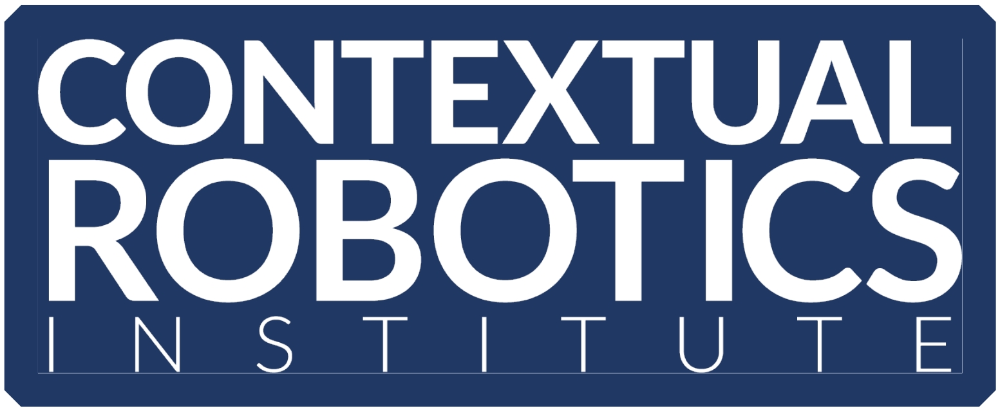

<div align="center">
  <a href="http://erl.ucsd.edu/">
    
  </a>
  <a href="https://contextualrobotics.ucsd.edu/">
    
  </a>
  <a href="https://ucsd.edu/">
    
  </a>
</div>

# Planning Operator: Generalizable motion planning via operator learning

 <a href="#"></a>


_[Paper](https://openreview.net/pdf?id=UYcUpiULmT) |
[GitHub](https://github.com/ExistentialRobotics/PNO) |
[arXiv](https://arxiv.org/abs/2410.17547) |
Published in ICLR 2025.


## Introduction

This repository is the official implementation of "Generalizable Motion Planning via Operator Learning". Please refer to the 2D example below for quick access into the method 
and for a futher dive, please see the models section below. 

### 2D example
See `examples` folder for a notebook that immediately reproduces the 2D results for the paper. To get the notebook working, 
we provide both pretrained models as well as the corresponding datasets to make your own at 
- [Dataset](https://huggingface.co/datasets/lukebhan/generalizableMotionPlanning)
- [Models](https://huggingface.co/lukebhan/generalizableMotionPlanningViaOperatorLearning)

To ensure the paths are correct, place both folders inside the example folder. The dataset is quite large and may take some time to download. 
The current example is working under Python 3.10.1, PyTorch Version 2.5.1, and the compatabile numpy libraries. Be sure to use this version
of torch in your Cuda enviornment to avoid compatabilitiy issues. 

Installation

- Setup your CUDA environment (or CPU) with the corresponding packages
  
  >The repository directory should look like this:
```
PNO/
├── examples/
│   ├── dataset/    # training and testing dataset
│   ├── results/    # training results
│   ├── utilities/    
│   ├── model/ # model implementations
│   └── 2DexampleNotebook.ipynb   # jupyternotebook
•   •   •
•   •   •
```
where the hierarchy is given via bullets and the results folder has all of the models downloaded from Hugging Face.

- Run the jupyter-notebook. Sections 1 and 2 allow you to train your own models but they can be skipped. Sections 3 and 4 quantitatively test the models and reproduce the results in the paper. 

If you have any issues, feel free to create an issue in this github repo or email the authors. 

### 3D and 4D Models from the paper 

We share the datasets for training the 3D and 4D models available here:
https://drive.google.com/drive/folders/1qaw0HXASEdKSN94yIYvmCMTpz0GbKUUJ?usp=sharing


### Citation 
If you found this work useful, we would appreciate if you could cite our work:
```
@inproceedings{
matada2025generalizable,
title={Generalizable Motion Planning via Operator Learning},
author={Sharath Matada and Luke Bhan and Yuanyuan Shi and Nikolay Atanasov},
booktitle={The Thirteenth International Conference on Learning Representations},
year={2025},
url={https://openreview.net/forum?id=UYcUpiULmT}
}
```

### Licensing
<a rel="license" href="http://creativecommons.org/licenses/by-nc-sa/4.0/"></a><br />This work is licensed under a <a rel="license" href="http://creativecommons.org/licenses/by-nc-sa/4.0/">Creative Commons Attribution-NonCommercial-ShareAlike 4.0 International License</a>.

